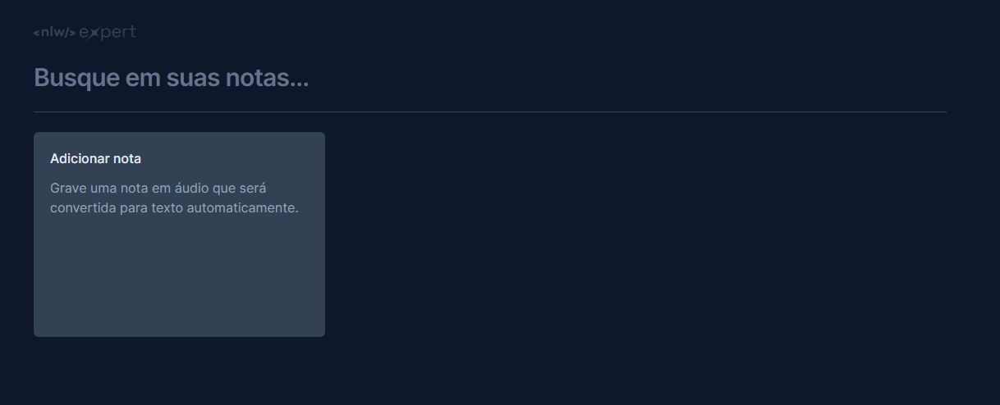

<h1 align="center"> NLW Expert Notes </h1>

Projeto realizado no evento NLW Expert da [Rocketseat](https://www.rocketseat.com.br) com o objetivo de aprofundar os conhecimentos em React.js e JavaScript. A aplicação consiste em um quadro de notas em que as notas podem ser gravadas manualmente em forma de texto ou em áudio transcrito.

  

## 🚀 Tecnologias

Esse projeto foi desenvolvido com as seguintes tecnologias:

- HTML e CSS
- Tailwind
- Java Script
- Typescript
- React.js
- Git e Github
- Figma

## 🔖 Layout

Você pode visualizar o layout do projeto através [DESSE LINK](https://www.figma.com/file/TZQxnkbD521WbpJz79RJZc/NLW-expert-%E2%80%A2-Notes-(Community)?type=design&node-id=2-287&mode=design&t=yqmfbHxJlr9sbeDR-0). É necessário ter conta no [Figma](https://figma.com) para acessá-lo.
